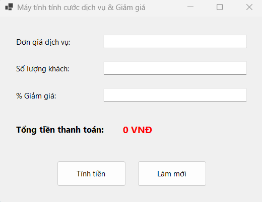
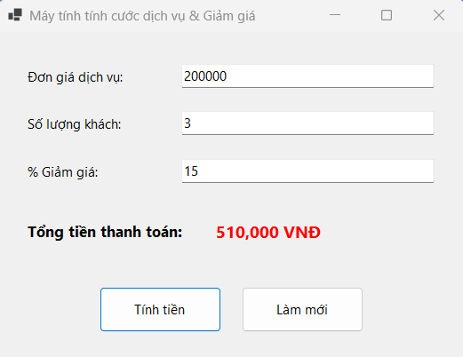
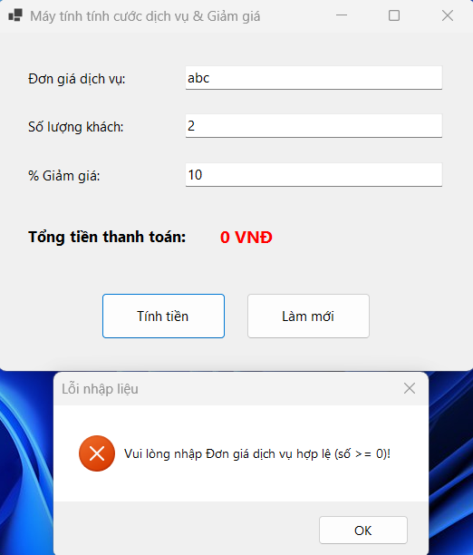

# BÁO CÁO BÀI TẬP / ĐỒ ÁN

## THÔNG TIN SINH VIÊN
- **Họ và tên:** NGUYỄN VŨ NHẬT MINH
- **Mã số sinh viên:** 24810320314
- **Lớp:** D19QTANM1
- **Tên môn học:** Lập trình .NET
- **Tên bài tập:** BÀI TẬP 1 - Máy tính tính cước dịch vụ & Giảm giá

---

## KẾT QUẢ THỰC HÀNH

### 1. Ảnh GD chính

### 2. Ảnh KQ thực thi

### 3. Ảnh KT lỗi
